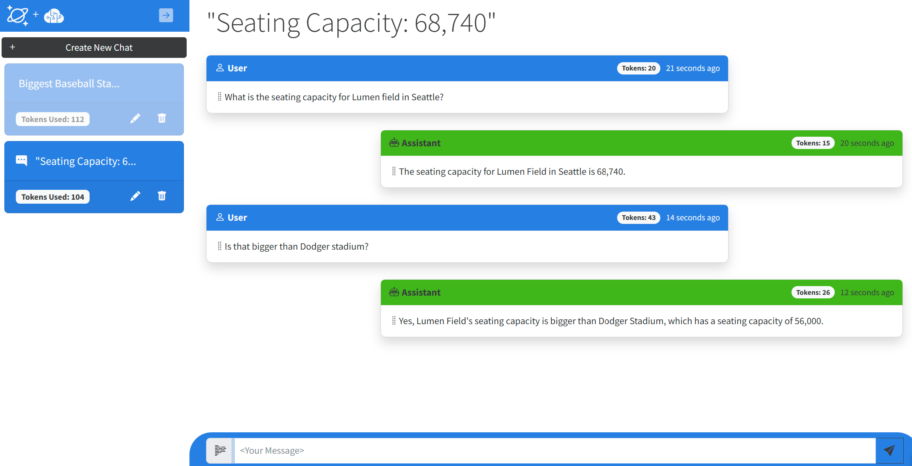

<!-- YAML front-matter schema: https://review.learn.microsoft.com/en-us/help/contribute/samples/process/onboarding?branch=main#supported-metadata-fields-for-readmemd -->

# Chat application with Azure Cosmos DB for NoSQL and Azure OpenAI

This sample chat application answers questions from the user and tracks chat history across conversations. 



## Quickstart

Use the [Azure Developer CLI](https://learn.microsoft.com/azure/developer/azure-developer-cli) to get started with this project quickly.

### Prerequisites

> This template will create infrastructure and deploy code to Azure. If you don't have an Azure Subscription, you can sign up for a [free account here](https://azure.microsoft.com/free/). Make sure you have the contributor role in the Azure subscription.

- [Azure Developer CLI](https://aka.ms/azd-install)
- [.NET SDK 8.0](https://dotnet.microsoft.com/download/dotnet/8.0) 
- [Docker Desktop](https://www.docker.com/products/docker-desktop/)

### Instructions

1. Log in to AZD.
    
    ```bash
    azd auth login
    ```

    > [!NOTE]  
    > This is only required once per install.

1. Initialize the project in the current directory.
    
    ```bash
    azd init --template chat-csharp-cosmos-db-nosql-openai
    ```

1. Deploy the services to Azure, build your container, and deploy the application.
    
    ```bash
    azd up
    ```

### Making changes

If you make changes to the application code, you can run `azd deploy` to deploy the latest version of your application code.

## Development container

A development container is available with [.NET 8](https://dotnet.microsoft.com/download/dotnet/8.0), [Azure CLI](https://learn.microsoft.com/cli/azure/), and [Azure Developer CLI](https://learn.microsoft.com/azure/developer/azure-developer-cli) already pre-installed.

[](https://codespaces.new/Azure-Samples/chat-csharp-cosmos-db-nosql-openai?quickstart=1)

## Technology stack

This application uses [ASP.NET Core Blazor](https://learn.microsoft.com/aspnet/core/blazor) and the [C#](https://learn.microsoft.com/dotnet/csharp/) programming language.

### Azure services

These services are deployed to Azure

| | Description |
| --- | --- |
| **[Azure Cosmos DB for NoSQL](https://learn.microsoft.com/azure/cosmos-db/nosql/)** | History and data storage |
| **[Azure OpenAI](https://learn.microsoft.com/azure/ai-services/openai)** | Chat completion |
| **[Azure Container Registry](https://learn.microsoft.com/azure/container-registry)** | Docker container registry |
| **[Azure Container Apps](https://learn.microsoft.com/azure/container-apps)** | Web application host |
